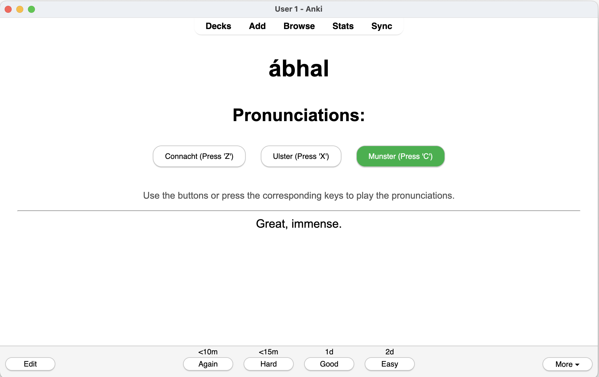
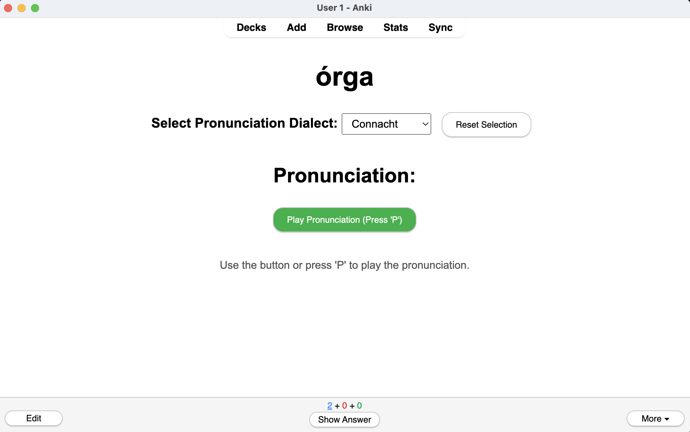

# Irish Word Pronunciations Anki Card

 
 

An interactive Anki card designed to help learners master the pronunciation of Irish words across three major dialects: Connacht, Ulster, and Munster. This card provides audio pronunciations, interactive buttons, and keyboard shortcuts to enhance your learning experience.

## Table of Contents

- [Features](#features)
- [Demo](#demo)
- [Installation](#installation)
- [Usage](#usage)
- [Customization](#customization)
- [Troubleshooting](#troubleshooting)
- [Contributing](#contributing)
- [License](#license)

## Features

- **Three Dialects:** Listen to pronunciations in Connacht, Ulster, and Munster dialects.
- **Interactive Buttons:** Play pronunciations using on-screen buttons.
- **Keyboard Shortcuts:** Use 'Z', 'X', and 'C' keys for quick access to pronunciations.
- **Dynamic Updates:** Easily update the word to learn using the input field.
- **Audio Load Handling:**
  - **Grey Out Buttons:** Buttons are disabled and greyed out if the audio fails to load.
  - **Visual Feedback:** Buttons change color while audio is playing to indicate active playback.

## Demo

 <!-- Replace with actual demo GIF URL -->

## Installation

### Prerequisites

- **Anki:** Ensure you have [Anki](https://apps.ankiweb.net/) installed on your computer.
- **Basic Knowledge of Anki Cards:** Familiarity with creating and editing Anki cards.

### Steps

1. **Download the HTML File:**
   - Clone this repository or download the `card-front.html` file directly.

2. **Create a New Card in Anki:**
   - Open Anki and navigate to the deck where you want to add the card.
   - Click on `Add` to create a new card.

3. **Set Up the Card Template:**
   - In the `Add` window, switch to the `Cards...` option to edit the card template.
   - Replace the content of the `Front Template` or `Back Template` with the HTML code from `index.html`.
   - Ensure that you adjust the placeholders (e.g., `{{Word}}`) to match your Anki fields.

4. **Add Necessary Fields:**
   - Make sure your note type includes a `Word` field or adjust the placeholders in the HTML accordingly.

5. **Save and Review:**
   - Save the card and start reviewing. You should see the interactive pronunciation buttons on your card.

## Usage

1. **Viewing the Card:**
   - When you view the card, it displays the word you want to learn along with three pronunciation buttons corresponding to different Irish dialects.

2. **Playing Pronunciations:**
   - **Buttons:** Click on the Connacht (`Z`), Ulster (`X`), or Munster (`C`) buttons to hear the pronunciation.
   - **Keyboard Shortcuts:** Press the `Z`, `X`, or `C` keys on your keyboard to play the corresponding pronunciation.

3. **Visual Indicators:**
   - **Disabled Buttons:** If a pronunciation audio fails to load, the corresponding button will be greyed out and disabled.
   - **Active Playback:** When an audio pronunciation is playing, the respective button changes color to indicate active playback.

## Customization

You can customize the card to better fit your preferences or specific use cases.

### Changing Button Colors

Modify the `.playing` class in the `<style>` section to change the color of buttons while audio is playing.

```css
.playing {
    background-color: #4CAF50; /* Change to desired color */
    color: white;
}
```

### Adjusting Audio Sources

Ensure that the audio source URLs are correct and accessible. If you have a different source for pronunciations, update the `updatePronunciations` function accordingly.

```javascript
function updatePronunciations() {
    var encodedWord = encodeURIComponent(word);
    audioZ.src = 'https://www.teanglann.ie/CanC/' + encodedWord + '.mp3'; // Connacht
    audioX.src = 'https://www.teanglann.ie/CanU/' + encodedWord + '.mp3'; // Ulster
    audioC.src = 'https://www.teanglann.ie/CanM/' + encodedWord + '.mp3'; // Munster
    // Add or modify sources as needed
}
```

### Styling Adjustments

Feel free to modify the CSS to match your preferred styling or to better integrate with your Anki theme.

```css
body {
    font-family: Arial, sans-serif;
    margin: 30px;
    text-align: center;
}
/* Add more styles as needed */
```

## Troubleshooting

### Audio Not Playing

- **Check Audio Sources:** Ensure that the audio URLs are correct and accessible.
- **Internet Connection:** Verify that you have an active internet connection to load the audio files.
- **Browser Restrictions:** Some browsers or Anki configurations might block autoplay or audio playback. Ensure that your settings allow audio playback.

### Buttons Not Responding

- **JavaScript Errors:** Inspect the card for any JavaScript errors that might prevent buttons from functioning.
- **Field Mismatch:** Ensure that the `{{Word}}` placeholder matches the field name in your Anki note type.

## Contributing

Contributions are welcome! If you'd like to improve this project, please follow these steps:

1. **Fork the Repository:** Click the `Fork` button at the top-right corner of this page.
2. **Create a Branch:** Create a new branch for your feature or bugfix.
3. **Make Changes:** Commit your changes with clear and descriptive messages.
4. **Submit a Pull Request:** Open a pull request detailing your changes and the reasons behind them.

## License

This project is licensed under the [MIT License](LICENSE).

